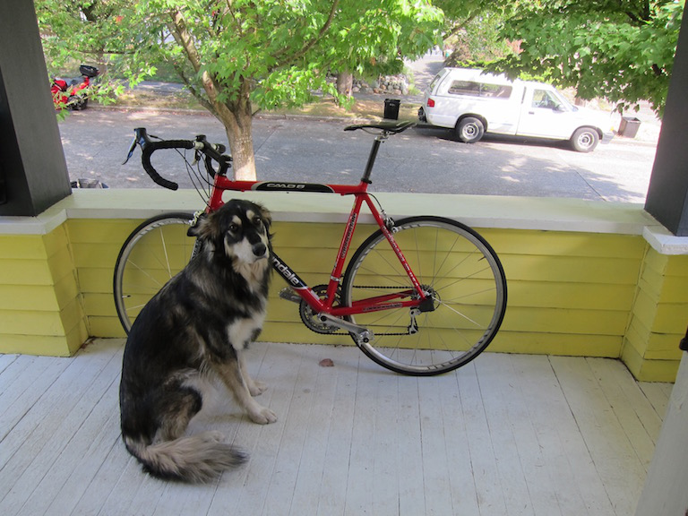

# DarkNet-Object-Detection-App

A web-app that provides object detection using YOLO-v3 and also an API.

It's implemented using django framework and PyTorch (for YOLO model). The app uses cloudinary API for image hosting.

### Dependencies

<ul>
    <li> 
        <a href="https://www.djangoproject.com/" >Django</a>
    </li>
    <li> 
        <a href="https://pytorch.org/" >PyTorch</a>
    </li>
    <li>
        <a href="https://pillow.readthedocs.ioenstable" >Pillow</a>
    </li>
    <li>
        <a href="https://opencv.org/" >OpenCV</a>
    </li>
</ul>

You also need to download the `yolo.weights` file and place it in the "weights" directory.

You can download the weights by - 
```
    $ wget https://pjreddie.com/media/files/yolov3.weights
```
### Usage

Firstly, you need to put your cloudinary credentials (cloud_name, api_key and api_secret) in ```settings.py``` file.

To run the server
```
    $ pip3 install -r requirements.txt
    $ python3 manage.py collectstatic
    $ python3 manage.py runserver
```


#### Input

You can send either of the following parameters -

Parameter | Type                           | Description
--------- | ------------------------------ | ---------------------------------------------------------------------------------
image     | file                           | Image file that you want to detect.
image64   | text                           | Image in base64 form that you want to detect. Currently supports JPEG images only

#### Result

Parameter | Type                | Description
--------- | ------------------- | -----------------------------------------------
success   | bool                | Whether classification was successful or not 
detect    | class label, float  | pair of label and its confidence
url       | image URL           | Link to the result image uploaded to cloudinary

Example:  {"success": true, "detect": {  "dog": 0.9989, "truck": 0.9999 }, 'url':"https://example.com/image.png"}<br>
"detect" will be empty if no objects are detected.

### Example

The website also shows the detection output with bounding boxes around the detected objects. There will be no box if the input doesn't contain any object.

#### Input 



#### Output


No. of objects detected - 3 <br>

The result image is generated using matplotlib.

### TO-DO

<ul>
    <li>Move app to Google Cloud Platform</li>
</ul>
